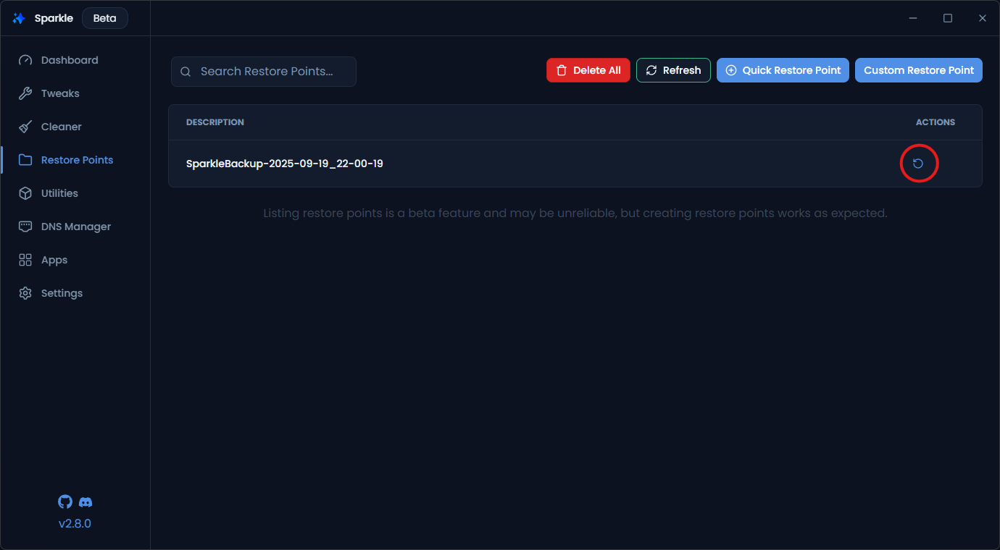

# Uninstalling CHLOtimizer

## Restore Points (Optional)
If you would like to restore your system to a point before you used tweaks inside of CHLOtimizer, you can use a restore point either one created by CHLOtimizer or one you created yourself, whether it’s in CHLOtimizer or in Windows.

<!--  -->

## Step 1: Revert Tweaks

 if you want to restore your pc to its state before using chloptimizer:

 1. Open **CHLOtimizer**
 2. Navigate to the **Tweaks** page.
 3. Unapply All Tweaks you dont want anymore.
 5. Restart Your PC.

## Step 2: Uninstalling CHLOtimizer

1. **Close CHLOtimizer**: Make sure chloptimizer is not running at all on your system. be sure to check the tray

2. **Uninstall the App**: Go to `Settings > Apps > Installed Apps`, or click [Here](ms-settings:appsfeatures) locate CHLOtimizer, and choose **Uninstall**.
  
## Advanced Method

If you want to completely remove CHLOtimizer from your system without leaving any leftover files, you can use **BCUninstaller**.
It can be installed via **CHLOtimizer**, Winget, or directly from the [official release page](https://github.com/Klocman/Bulk-Crap-Uninstaller/releases/latest).
